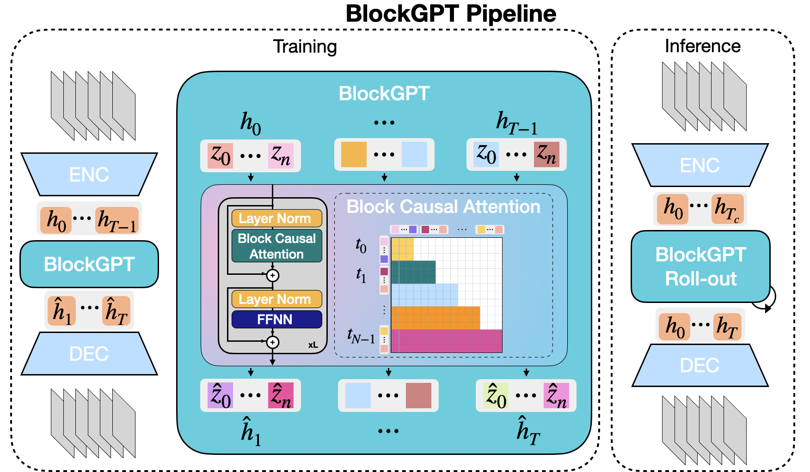

# BlockGPT: Autoregressive Video Prediction for Precipitation Nowcasting

BlockGPT is a spatio-temporal generative model designed for precipitation nowcasting. It models weather evolution as a video prediction task using transformer-based architectures. This repository provides pipelines for:

- BlockGPT and NowcastingGPT (autoregressive models)
- DiffCast + BlockGPT (diffusion-based hybrid)
- DiffCast + PhyDNet (benchmark)
- VQGAN/VAE encoders

---
## Model Architecture
BlockGPT is a two-stage, frame-level autoregressive model for precipitation nowcasting. Each 128×128 radar frame is tokenized by a VQ-GAN into an 8×8 grid (64 tokens) from a 1,024-entry codebook, preserving 2D structure while compressing space. A Transformer then predicts the entire next latent frame conditioned on past frames using a block attention mask: bidirectional attention within a frame (spatial coherence) and strictly causal attention across frames (temporal order). The model uses 8 layers, 8 heads, 1,024-dim embeddings, and ~103M parameters, trained for 500k steps (batch 8). This frame-level factorization removes arbitrary token ordering and yields around **27–31 times faster inference with improved skill**.


## Qualitative Results
> For more experimental results, please refer to our [paper](https://arxiv.org/abs/2510.06293)!
### SEVIR30 Dataset
BlockGPT (second row) best maintains structure and motion; a tendency to overestimate peak intensity emerges at longer lead times.

### KNMI30 Dataset 
BlockGPT (second row) preserves the rainband morphology and advection but modestly overestimates the core intensity at long lead times; baselines miss the shape and location.

## 🗺️ Repository Structure

```
configs/                 # All JSON/YAML configs for training and evaluation
    GPT/                 # Configs for BlockGPT & NowcastingGPT
    Evaluations/         # Evaluation config files. Used by evaluate.py. Paths to model checkpoints which need to be evaluated are placed here for convenience. 
    Encoders/            # Config for the encoders that can be trained in this repo (vqgan,vae,vqgan with perturbations). Only VQGAN is used in BlockGPT.
    config_blockGPTBackbone/ # BlockGPT backbone used in DiffCast
    

dataset/                 # Dataset loaders and path setup
    get_datasets.py      # Entry point for dataset selection
    dataset_knmi.py      # dataset specific dataloaders
    dataset_sevir.py

job_scripts/             # SLURM job scripts (tested on Snellius)
    *.sh                 # Jobs for training encoders, GPTs, and DiffCast variants. Note that the GPT can only train with 1 GPU on quechua due to an error (command included where required)

models/
    blockGPT/            # Core transformer class (shared by BlockGPT & NowcastingGPT)
    diffusion/           # dependencies used by diffusion blocks 
    phydnet/              # phydnet as diffcast backbone 
    taming/              # encoder repository modified from Taming Transformers 
    diffcast.py/         # Diffcast class
    blockGPTBackbone.py/ # Class unifying the VQGAN and GPT into a single class for diffcast backbone

Results/
    Evaluations/         # Metrics & visualizations for evaluated models, written to by evaluate.py
    FinalPickledResults/ # Pickled evaluation results used in thesis

utils/                   # Utility functions used across training & evaluation

main scripts/
    train_encoder.py     # Train VQGAN, VAE, or perturbed VQGAN
    train_gpt.py         # Train BlockGPT or NowcastingGPT
    train_diffcast.py    # Train DiffCast with PhyDNet or BlockGPT
    evaluate.py          # Evaluate trained models
    plot_metrics.ipynb   # Plot results from stored pickle files
```

---

## 🛠️ Installation

```bash
# Step 1: Create environment
conda env create -f blockgpt_env.yml
conda activate blockgpt

# Step 2: Patch huggingface_hub if needed
# If you get an import error from dynamic_utils.py:
# Replace this:
# from huggingface_hub import cached_download, hf_hub_download, model_info
# With this:
# from huggingface_hub import hf_hub_download, model_info

# Step 3: Install specific versions
pip install imageio==2.33.0 --no-deps
pip install ema-pytorch
```

---

## 📦 Dataset Setup

### KNMI

The curated KNMI dataset (5-min and 30-min variants) should be locally available. Update paths in:

```
dataset/get_datasets.py
```

Make sure to set correct paths for both the 30 minute and 5 minute variants.

### SEVIR

For SEVIR, path to the raw data should be placed in `get_datasets.py`.

---

## 🏋️ Training

### VQGAN / Encoder

```bash
# Run the job script or manually launch train_encoder.py
accelerate launch --multi_gpu --num_processes=2 train_encoder.py --dataset knmi --encoder vqgan --encoder_config configs/Encoders/config_vqgan.json
```

### BlockGPT / NowcastingGPT

```bash
# Make sure VQGAN checkpoint paths are correctly passed. Either run the job_scripts which have all information, or run directly. For example, for KNMI 30:
accelerate launch --multi_gpu --num_processes=2 --main_process_port=29300 train_gpt.py --dataset_name knmi --exp_name blockGPT_KNMI30 --seed 0 --vqgan_type vqgan --pretrained_model_name_or_path /projects/0/prjs0951/Varun/Checkpoints/vqgan_knmi_7M_1024_ckpt-177500.pt --config_name configs/GPT/config_blockGPT_KNMI30.json --per_device_train_batch_size 4 --gradient_accumulation_steps 1 --learning_rate 1e-5 --lr_scheduler_type cosine --resolution 128 --dataloader_num_workers 8 --video_stepsize 1 --segment_length 9 --context_length 3 --use_eval_dataset --weight_decay 0.01 --llama_attn_drop 0.1 --embed_no_wd --predictor_name blockGPT --encoder_config configs/Encoders/config_vqgan.json --validation_steps 5000
```

### DiffCast + PhyDNet

```bash
#Run the job script or run:
accelerate launch --multi_gpu --num_processes=2 train_diffcast.py --dataset knmi --backbone phydnet --use_diff
```

### DiffCast + BlockGPT

```bash
#Run the job script or run: (I have tested only SEVIR 30 minutes)
accelerate launch  --multi_gpu --num_processes=2 train_diffcast.py --dataset sevir --backbone blockGPTBackbone --use_diff --temp_res_sevir 30 --seq_len_sevir 49 --backbone_config configs/config_blockGPTBackbone_SEVIR30.json
```

> 📝 Quechua note: Job scripts are SLURM-based and used on Snellius. For Quechua, launch scripts manually in a `screen` or `nohup` session.

---

## 📊 Evaluation

To evaluate models:

1. Edit the YAML file in `configs/Evaluations/` to specify paths to model checkpoints.
2. Run:

```bash
python evaluate.py --config configs/Evaluations/evaluate_config_KNMI30.yaml
```

This will output:

- Visualizations of predictions
- `.pkl` files of metrics
- A `.txt` listing the evaluated models

Please note that I have carried out evaluations only on quechua. If you choose to run it on snellius, please update the job request to accomodate more cpu space.

---

## 📊 Results & Visualization

Use `plot_metrics.ipynb` to load the `.pkl` files from `FinalPickledResults/` and generate thesis-quality plots.

---

## 📚 Acknowledgements

- [NowcastingGPT: Extreme Precipitation Nowcasting using Transformer-based Generative Models](https://arxiv.org/abs/2403.03929)
- [DiffCast: A Unified Framework via Residual Diffusion for Precipitation Nowcasting](https://arxiv.org/abs/2312.06734)
- [Disentangling Physical Dynamics from Unknown Factors for Unsupervised Video Prediction](https://arxiv.org/abs/2003.01460)

---

## 🔮 Citation
*If you use BlockGPT in your research, please cite this repository.*
```bibtex
@misc{meo2025blockgptspatiotemporalmodellingrainfall,
title={BlockGPT: Spatio-Temporal Modelling of Rainfall via Frame-Level Autoregression}, 
author={Cristian Meo and Varun Sarathchandran and Avijit Majhi and Shao Hung and Carlo Saccardi and Ruben Imhoff and Roberto Deidda and Remko Uijlenhoet and Justin Dauwels},
year={2025},
eprint={2510.06293},
archivePrefix={arXiv},
primaryClass={cs.LG},
url={https://arxiv.org/abs/2510.06293}, 
}
```
<!-- ## Checkpoints 

Checkpoints for all models used in my thesis are both on snellius and quechua. 
On snellius: /projects/0/prjs0951/Varun/FinalCheckpoints
On quechua: /space2/vsarathchandra/iVideoGPT/FinalCheckpoints -->
